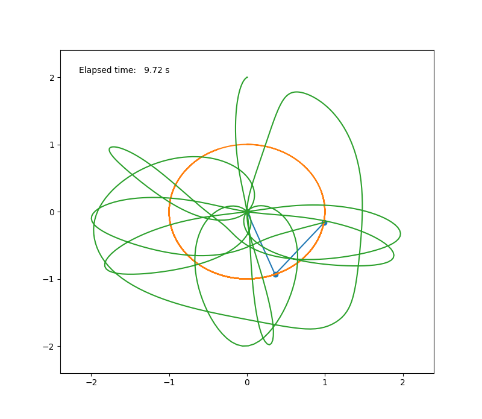

# Esame
### The Double Pendulum

The double pendulum is a classical exercise of mechanics. Consider the approximation that each pendulum consists of a point mass  hanging on an ideal (non-elastic, mass-less) string of length  in a constant, homogeneous  gravitational field of acceleration . While the first pendulum is attached to a rigid, motionless point, the second is attached to the point mass of the first one,  drawing a chaotic trajectory. Moreover, the motion here only happens in a single plane, so that each pendulum is attached by a rigid string to a specific point, and to greatly semplify the equation I assumed that  and 

This means that the system is described by a set of four first order differential equations, two for each degree of freedom:

}{1&space;+&space;sin^2(\theta_1&space;-&space;\theta_2)})

}{1&space;+&space;sin^2(\theta_1&space;-&space;\theta_2)})

&space;-&space;A&space;+&space;B)

&space;+&space;A&space;-&space;B)

where

}{1&space;+&space;sin^2(\theta_1&space;-&space;\theta_2)})

}{2[1&space;+&space;sin^2(\theta_1&space;-&space;\theta_2)]^2}sin[2(\theta_1&space;-&space;\theta_2)])

### Structure of the project
These are the steps in order to start the program and get the animation:

1) First the user has to choose the configurations he/she prefers, using the syntax of [config](https://github.com/GiuliaPolverini/Esame/blob/master/config.json);
2) Then to make the simulation run the user has to FILE DOUBLEPEND
3) At the end ...

This is how I divided my project into blocks:

- In the file [PendulumSimulation](https://github.com/GiuliaPolverini/Esame/blob/master/PendulumSimulation.py) I have initialized some parameters as the initial state of the system and the time, solved the differential equations for the system thanks to the odeint package and got the cartesian coordinates for each position; in the last part I tested ....

- In the file [Animator](https://github.com/GiuliaPolverini/Esame/blob/master/Animator.py) I have set the length of time for the simulation, the size of the animation window and of the plot and how the text window has to evolve; then I have built the line of the pendulum with its three points (the central pin and the two masses), inizializing their positions and the trace to draw the trajectory; at the end I created a cycle to iterate the frames and update the positions and the traces.

- In the file [config](https://github.com/GiuliaPolverini/Esame/blob/master/config.json) there are the parameters the user can vary according to how he/she wants them.

- In the file [DoublePendulum](https://github.com/GiuliaPolverini/Esame/blob/master/DoublePendulum.py) first I have brought out the values I needed from the [config](https://github.com/GiuliaPolverini/Esame/blob/master/config.json) file to create the system; then I have given the comand to create the simulation and the animation.

This is how the animation looks like after 9,72 seconds:

